<h1 align="center">Juan Manuel Torres</h1>

<p align="center">
  <strong>Geospatial Software Developer · Backend & Data · Territorial Intelligence · Agentic Workflows</strong>
</p>

<p align="center">
  
</p>

<p align="center">
  <a href="https://www.linkedin.com/in/juanmtorres23/"></a>
  <a href="https://juanmtorres.vercel.app/"></a>
  <a href="https://sanjuangeo.vercel.app/"></a>
  <a href="https://github.com/juanmanueltorres-creator/geo-agent-langgraph"></a>
</p>

<p align="center">
  
</p>

<p align="center">
  
</p>

## About

I work at the intersection of **geosciences, spatial data, backend engineering, and AI-assisted software**.

My background in **geology and mining** shapes how I build systems: the map is not just a visualization layer — it is an interface for querying, validating, connecting, and interpreting what is happening around an area of interest.

> **Territory → evidence → spatial data → software → decision context.**

## What I build

<table>
<tr>
<td width="33%" valign="top">

### 🌍 GeoPlatform

Territorial intelligence for **mining, environment, routes, and operational context**.

`2D/3D` · `PostGIS` · `Satellite` · `Reports` · `AI-assisted`

<a href="https://sanjuangeo.vercel.app/"><strong>Open platform →</strong></a>

</td>
<td width="33%" valign="top">

### 🗺️ Spatial systems

Backends that connect **territory, APIs, data models, access control, and traceable context**.

`FastAPI` · `PostGIS` · `OGC` · `Integrations` · `APIs`

</td>
<td width="33%" valign="top">

### 🧠 Agentic workflows

LLM systems that use **real tools and real sources**, validate outputs, and keep humans in the loop.

`LLMs` · `MCP` · `LangGraph` · `Tool Calling` · `Guardrails`

</td>
</tr>
</table>

## Core stack

### Geospatial & Domain


### Backend & Data


### Frontend & Product


### AI Systems


### Production & Reliability


## Featured work

<table>
<tr>
<td width="50%" valign="top">

### [GeoPlatform](https://sanjuangeo.vercel.app/)

**Territorial intelligence platform** focused on mining, environment, and operational context.

**Highlights**
- FastAPI + PostgreSQL/PostGIS spatial backend
- Leaflet + Cesium 2D/3D interfaces
- Satellite, weather, environmental, and public territorial data
- Traceable context and reporting workflows
- Authentication, access control, integrations, and production safeguards

</td>
<td width="50%" valign="top">

### [geo-agent-langgraph](https://github.com/juanmanueltorres-creator/geo-agent-langgraph)

**Minimal geospatial AI agent** built to understand how agentic systems work in real software.

**Highlights**
- LangChain + LangGraph workflow
- Real weather, elevation, and territorial APIs
- Deterministic validation and retry logic
- Tool-enabled LLM execution
- Emphasis on real context over AI-only answers

</td>
</tr>
</table>

## Current focus

```text
GEOSCIENCES  →  SPATIAL DATA  →  BACKEND  →  AI SYSTEMS  →  PRODUCT
     │               │              │             │              │
 territory        PostGIS        FastAPI       tools/LLMs     decisions
```

- Building **production-style geospatial software**
- Strengthening **Python, backend engineering, data architecture, and integrations**
- Exploring **AI systems that operate on real tools, evidence, and context**
- Designing products that reduce uncertainty around **territory, evidence, and decisions**

<details>
<summary><strong>Why geospatial?</strong></summary>
<br />

Because a coordinate alone rarely explains a problem. Useful territorial software needs to connect the point with its **surrounding geology, environment, infrastructure, time, evidence, uncertainty, and operational context**.

That idea connects my work across GeoPlatform, geospatial backends, and Anti IA.

</details>

## Contact

<p>
  📍 Córdoba, Argentina<br />
  ✉️ <code>juan.manuel.torres@mi.unc.edu.ar</code><br />
  🔗 <a href="https://www.linkedin.com/in/juanmtorres23/">linkedin.com/in/juanmtorres23</a>
</p>

---

<p align="center">
  <strong>GeoPlatform · Anti IA · Territorial Intelligence</strong><br />
  <sub>Mining foundations → Geosciences → Geospatial systems → Software & data → Automation → AI systems → Product</sub>
</p>
