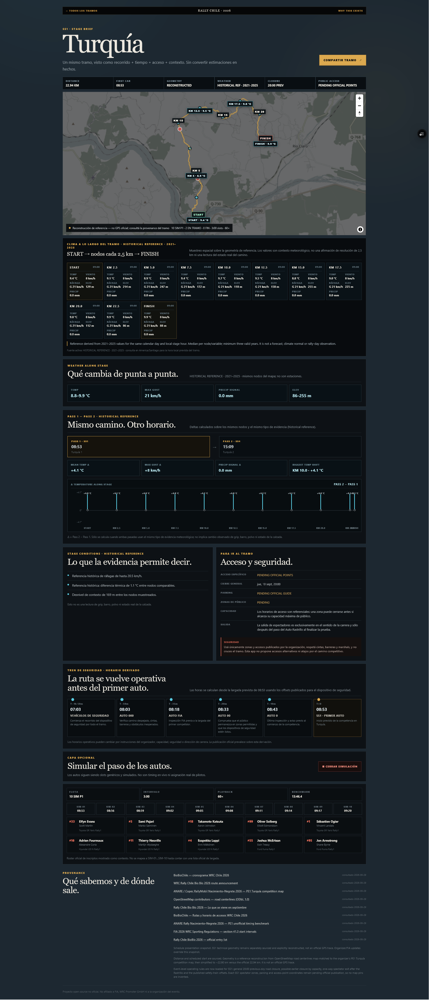

<p align="center">
  
</p>

<p align="center">
  <a href="https://www.linkedin.com/in/juanmtorres23/"></a>
  <a href="https://juanmtorres.vercel.app/"></a>
  <a href="https://sanjuangeo.vercel.app/"></a>
  <a href="https://juanmanueltorres-creator.github.io/pulso-publico-argentina/"></a>
  <a href="https://juanmanueltorres-creator.github.io/fleetflow-sim/"></a>
</p>

<p align="center">
  
</p>

<p align="center">
  <sub>◈ TERRITORIAL PARTY · ARGENTINA ◈</sub>
</p>

<p align="center">
  
  &nbsp;&nbsp;&nbsp;
  
  &nbsp;&nbsp;&nbsp;
  
  &nbsp;&nbsp;&nbsp;
  
</p>

<p align="center"></p>

## SELECTED BUILDS

### 01 / [GeoPlatform](https://sanjuangeo.vercel.app/)

<p align="center">
  <a href="https://sanjuangeo.vercel.app/">
    
  </a>
</p>

<p align="center">
  <strong>LIVE APPLICATION</strong><br />
  <sub>A 2D/3D workspace for checking what is happening around a place: mining data, satellite imagery, weather, earthquakes, routes and field context.</sub><br />
  <sub><code>React</code> · <code>TypeScript</code> · <code>FastAPI</code> · <code>PostGIS</code> · <code>Leaflet</code> · <code>Cesium</code></sub>
</p>

<p align="center"></p>

### 02 / [Pulso Público Argentina](https://github.com/juanmanueltorres-creator/pulso-publico-argentina)

<p align="center">
  <a href="https://juanmanueltorres-creator.github.io/pulso-publico-argentina/">
    
  </a>
</p>

<p align="center">
  <strong>LIVE · OPEN SOURCE</strong><br />
  <sub>A public map of recent signals across Argentina: earthquakes, thermal detections, weather and national indicators, with the source and update time visible.</sub><br />
  <sub><code>React</code> · <code>TypeScript</code> · <code>MapLibre</code> · <code>Public Data</code></sub><br />
  <sub><a href="https://juanmanueltorres-creator.github.io/pulso-publico-argentina/">open app →</a> · <a href="https://github.com/juanmanueltorres-creator/pulso-publico-argentina">repository →</a></sub>
</p>

<p align="center"></p>

### 03 / Anti IA

<p align="center">
  
</p>

<p align="center">
  <strong>EXPERIMENTAL PRODUCT</strong><br />
  <sub>An evidence-first interface for territorial questions. Pick a case, see what is known, what is missing, what supports it and what question should come next.</sub><br />
  <sub><code>React</code> · <code>Territorial Cases</code> · <code>Evidence</code> · <code>Local Persistence</code></sub><br />
  <em>“Una coordenada no es un punto.”</em>
</p>

<p align="center"></p>

### 04 / [FleetFlow Sim](https://github.com/juanmanueltorres-creator/fleetflow-sim)

<p align="center">
  <a href="https://juanmanueltorres-creator.github.io/fleetflow-sim/">
    
  </a>
</p>

<p align="center">
  <strong>LIVE · OPEN SOURCE</strong><br />
  <sub>A delivery fleet simulator set in Córdoba. Vehicles follow routes, stop at deliveries, carry packages and expose distance, fuel and fleet KPIs while the simulation runs.</sub><br />
  <sub><code>React</code> · <code>TypeScript</code> · <code>MapLibre</code> · <code>Turf</code></sub><br />
  <sub><a href="https://juanmanueltorres-creator.github.io/fleetflow-sim/">open app →</a> · <a href="https://github.com/juanmanueltorres-creator/fleetflow-sim">repository →</a></sub>
</p>

<p align="center"></p>

### 05 / [Atlas Geotech](https://github.com/juanmanueltorres-creator/atlas-geotech)

<p align="center">
  <a href="https://github.com/juanmanueltorres-creator/atlas-geotech">
    
  </a>
</p>

<p align="center">
  <strong>PUBLIC REPOSITORY</strong><br />
  <sub>An interactive mining atlas for exploring Argentine projects by province, mineral, project stage, company and capital origin.</sub><br />
  <sub><code>R</code> · <code>Shiny</code> · <code>sf</code> · <code>dplyr</code></sub><br />
  <sub><a href="https://github.com/juanmanueltorres-creator/atlas-geotech">repository →</a></sub>
</p>

<p align="center"></p>

### 06 / [Rally Stage Sim](https://github.com/juanmanueltorres-creator/rally-stage-sim)

<p align="center">
  <a href="https://github.com/juanmanueltorres-creator/rally-stage-sim">
    
  </a>
</p>

<p align="center">
  <strong>PROTOTYPE</strong><br />
  <sub>A rally-stage experiment for combining moving cars, stage timing, weather and terrain on an interactive map.</sub><br />
  <sub><a href="https://github.com/juanmanueltorres-creator/rally-stage-sim">repository →</a></sub>
</p>

<p align="center"></p>

## LORE

```text
CLASS       Geospatial Software Developer
ORIGIN      Geology · Mining
DOMAIN      Territory · Spatial Data · Evidence
BUILD       FastAPI · PostGIS · React · Cesium
AI          LLMs · MCP · LangGraph · Tool Calling
FOCUS       Territorial Intelligence · Operational Context
```

I build software at the intersection of **geosciences, spatial data, backend engineering, and AI-assisted systems**.

My geology and mining background shapes how I design software: a map is not just a visualization layer. It is a way to connect a place with **data, time, evidence, uncertainty and operational context**.

<p align="center"></p>

## MORE SYSTEMS

<table>
<tr>
<td width="50%" valign="top">

### [Opportunity OS](https://github.com/juanmanueltorres-creator/opportunity-os)
A local-first job-search system for finding opportunities, tracking target companies, generating evidence-backed CVs and organizing outreach.

`Python` · `FastAPI` · `SQLite` · `Gmail Adapter`

</td>
<td width="50%" valign="top">

### [Question Radar](https://github.com/juanmanueltorres-creator/question-radar)
A Python tool that turns questions into structured data and shows what assumptions, evidence or next questions are missing.

`Python` · `SQLite` · `CLI` · `170 tests`

</td>
</tr>
<tr>
<td width="50%" valign="top">

### [Screen2Social](https://github.com/juanmanueltorres-creator/screen2social)
A local pipeline that turns OBS screen recordings into a ready-to-post video, thumbnail, metadata and optional local transcript.

`Python` · `FFmpeg` · `OBS WebSocket` · `whisper.cpp`

</td>
<td width="50%" valign="top">

### [Geo Agent](https://github.com/juanmanueltorres-creator/geo-agent-langgraph)
A small geospatial agent experiment built around tools, external sources and validation instead of AI-only answers.

`LangChain` · `LangGraph` · `Tool Calling`

</td>
</tr>
</table>

<p align="center"></p>

## 🌍 ORIGIN CHAPTER · INSIGHTLABORATORY

<p align="center">
  <a href="https://github.com/InsightLaboratory">
    
  </a>
</p>

<p align="center">
  <a href="https://github.com/InsightLaboratory"></a>
  
</p>

**InsightLaboratory** was my first public laboratory for building on the web. It is where I started experimenting with React, geospatial applications, Google Earth Engine, spatial databases and AI-assisted workflows.

<p align="center">
  <strong>2023 · Earth Engine</strong> &nbsp;→&nbsp; <strong>React</strong> &nbsp;→&nbsp; <strong>Spatial Databases</strong> &nbsp;→&nbsp; <strong>GeoPlatform</strong> &nbsp;→&nbsp; <strong>Territorial Systems</strong>
</p>

<p align="center">
  <code>InsightLaboratory → juanmanueltorres-creator</code>
</p>

<p align="center"></p>

## SKILL TREE

### Geospatial & Domain


### Backend & Data


### Frontend & Product


### AI Systems


### Production & Reliability


<p align="center"></p>

## PLAYER STATS

<p align="center">
  
</p>

<p align="center">
  <sub>Generated inside this repository by GitHub Actions every six hours — no external stats-card provider.</sub>
</p>

<p align="center"></p>

## CONTACT

<p align="center">
  <strong>Córdoba, Argentina</strong><br />
  <code>juan.manuel.torres@mi.unc.edu.ar</code><br />
  <a href="https://www.linkedin.com/in/juanmtorres23/">LinkedIn</a> · <a href="https://juanmtorres.vercel.app/">Portfolio</a> · <a href="https://github.com/juanmanueltorres-creator">GitHub</a>
</p>
