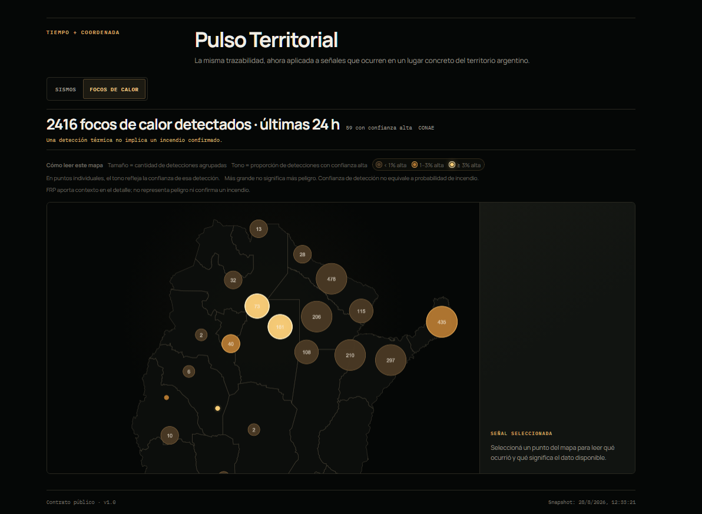
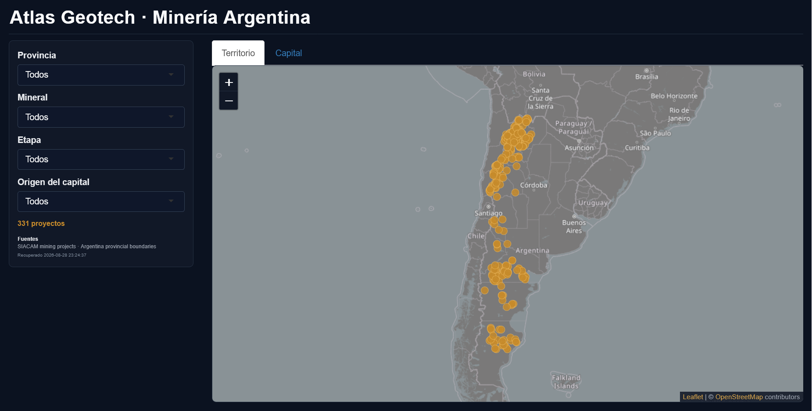
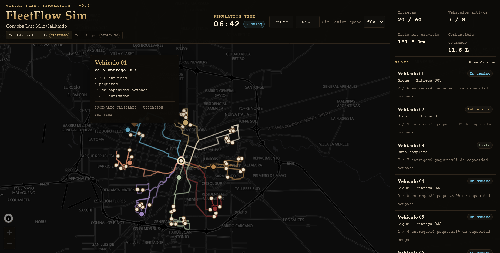

<p align="center">
  
</p>

<p align="center">
  <a href="https://www.linkedin.com/in/juanmtorres23/"></a>
  <a href="https://juanmtorres.vercel.app/"></a>
  <a href="https://sanjuangeo.vercel.app/"></a>
</p>

<p align="center">
  
</p>

<p align="center"><sub>◈ DECISION TECHNOLOGIES · ARGENTINA ◈</sub></p>

I am a **geospatial software developer with a background in geology and mining**. I build decision technologies that connect spatial data, evidence, simulation, operations and AI-assisted workflows.

> **Geospatial is one of the technologies. Decision-making is the purpose.**

```text
ORIGIN     Geology · Mining
BUILD      Spatial software · Data systems · Simulation
STACK      Python · PostGIS · React · TypeScript · R
FOCUS      Decision support · Evidence · Operations
METHOD     Contracts · Tests · Provenance · Human approval
```

<p align="center"></p>

## SELECTED BUILDS

### 01 / [GeoPlatform](https://sanjuangeo.vercel.app/)

<p align="center">
  <a href="https://sanjuangeo.vercel.app/">
    
  </a>
</p>

**2D/3D territorial intelligence workspace** for combining mining, satellite, weather, seismic, route and field context around a place.

`React` · `TypeScript` · `FastAPI` · `PostGIS` · `Leaflet` · `Cesium`

[open app →](https://sanjuangeo.vercel.app/)

---

### 02 / [Pulso Público Argentina](https://github.com/juanmanueltorres-creator/pulso-publico-argentina)

<p align="center">
  <a href="https://juanmanueltorres-creator.github.io/pulso-publico-argentina/">
    
  </a>
</p>

**Public territorial signals explorer** for seeing what is happening, where, and how the system knows it — with provenance, freshness and evidence state kept visible.

`React` · `TypeScript` · `MapLibre` · `Public Data`

[open app →](https://juanmanueltorres-creator.github.io/pulso-publico-argentina/) · [repository →](https://github.com/juanmanueltorres-creator/pulso-publico-argentina)

---

### 03 / [Atlas Geotech](https://github.com/juanmanueltorres-creator/atlas-geotech)

<p align="center">
  <a href="https://atlas-geotech.onrender.com/">
    
  </a>
</p>

**Argentina mining + territorial data explorer** built in R, connecting public SIACAM project data with spatial context, company/capital views and explicit interpretation boundaries.

`R` · `Shiny` · `sf` · `dplyr` · `Leaflet`

[open app →](https://atlas-geotech.onrender.com/) · [repository →](https://github.com/juanmanueltorres-creator/atlas-geotech)

---

### 04 / [FleetFlow Sim](https://github.com/juanmanueltorres-creator/fleetflow-sim)

<p align="center">
  <a href="https://juanmanueltorres-creator.github.io/fleetflow-sim/">
    
  </a>
</p>

**Visual last-mile operations simulator** for exploring daily fleet behavior and explicit What-If alternatives on an interactive map.

`React` · `TypeScript` · `MapLibre` · `Turf`

[open app →](https://juanmanueltorres-creator.github.io/fleetflow-sim/) · [repository →](https://github.com/juanmanueltorres-creator/fleetflow-sim)

<p align="center"></p>

## SYSTEMS & EXPERIMENTS

| System | What it explores |
| --- | --- |
| [Opportunity OS](https://github.com/juanmanueltorres-creator/opportunity-os) | Auditable, evidence-backed workflow automation for job search and outreach. |
| [Question Radar](https://github.com/juanmanueltorres-creator/question-radar) | Questions as structured, inspectable learning and research artifacts. |
| [Screen2Social](https://github.com/juanmanueltorres-creator/screen2social) | Local OBS recording → deterministic social-media package → human review. |
| [Andes Context OS](https://github.com/juanmanueltorres-creator/andes-context-os) | Territorial research context with provenance, authorization and evidence boundaries. |
| [San Juan Mining Ops Sim](https://github.com/juanmanueltorres-creator/sanjuan-mining-ops-sim) | Synthetic mining operations explored against real territorial context. |

These projects are intentionally different in domain, but they share the same engineering question: **how do we make context, uncertainty, evidence and authority visible before a system produces a decision-looking output?**

<p align="center"></p>

## ENGINEERING PRINCIPLES

```text
coordinate != knowledge
data != evidence
evidence != conclusion
model != territory
simulation != observation
AI != authority
```

I use AI-assisted development heavily, but I treat generated code, inferred context and automated actions as things that still need **contracts, tests, provenance, acceptance criteria and explicit authority boundaries**.

The goal is not to remove the human from the loop. It is to automate repetition while making the important decisions easier to inspect and defend.

<p align="center"></p>

## EARLIER WORK

My first public experiments since 2023 live under **[InsightLaboratory](https://github.com/InsightLaboratory)**, where I started working with Google Earth Engine, React, geospatial web applications and spatial databases.

```text
InsightLaboratory → GeoPlatform → Decision Technologies
```

<p align="center"></p>

## CONTACT

[Portfolio](https://juanmtorres.vercel.app/) · [LinkedIn](https://www.linkedin.com/in/juanmtorres23/) · [GitHub](https://github.com/juanmanueltorres-creator)
