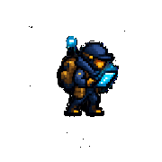
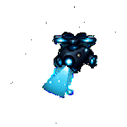
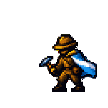

<p align="center">
  
</p>

<p align="center">
  <a href="https://www.linkedin.com/in/juanmtorres23/"></a>
  <a href="https://juanmtorres.vercel.app/"></a>
  <a href="https://sanjuangeo.vercel.app/"></a>
  <a href="https://github.com/juanmanueltorres-creator/geo-agent-langgraph"></a>
</p>

<p align="center">
  
</p>

<p align="center">
  <sub>◈ TERRITORIAL PARTY · ARGENTINA ◈</sub>
</p>

<p align="center">
  
  &nbsp;&nbsp;&nbsp;&nbsp;
  
  &nbsp;&nbsp;&nbsp;&nbsp;
  
  &nbsp;&nbsp;&nbsp;&nbsp;
  
</p>

<br />

<p align="center">
  
</p>
<p align="center">
  <a href="https://sanjuangeo.vercel.app/">
    
  </a>
</p>
<p align="center">
  
</p>
<p align="center">
  <sub><strong>Operational geospatial software</strong> for mining, environment, routes, spatial signals, and decision context · <a href="https://sanjuangeo.vercel.app/">open platform →</a></sub>
</p>

<br />

<p align="center">
  
</p>
<p align="center">
  
</p>
<p align="center">
  
</p>
<p align="center">
  <em>“Una coordenada no es un punto.”</em>
</p>

<p align="center"></p>

## LORE

```text
CLASS       Geospatial Software Developer
ORIGIN      Geology · Mining
DOMAIN      Territory · Spatial Data · Evidence
BUILD       FastAPI · PostGIS · React · Cesium
AI          LLMs · MCP · LangGraph · Tool Calling
FOCUS       Territorial Intelligence · Operational Context
```

I build software at the intersection of **geosciences, spatial data, backend engineering, and AI-assisted systems**.

My geology and mining background shapes how I design software: a map is not just a visualization layer — it is an interface for **querying, validating, connecting, and interpreting what is happening around an area of interest**.


<p align="center"></p>

## BUILD PATHS

<table>
<tr>
<td width="33%" valign="top">

### GeoPlatform
Territorial intelligence for **mining, environment, routes, and operational context**.

`2D/3D` · `PostGIS` · `Satellite` · `Reports`

<a href="https://sanjuangeo.vercel.app/"><strong>Open platform →</strong></a>

</td>
<td width="33%" valign="top">

### Spatial Systems
Backends that connect **territory, APIs, data models, access control, and traceable context**.

`FastAPI` · `PostGIS` · `OGC` · `REST`

</td>
<td width="33%" valign="top">

### Agentic Systems
LLM workflows that use **real tools and sources**, validate outputs, and keep humans in the loop.

`MCP` · `LangGraph` · `Tool Calling` · `Guardrails`

</td>
</tr>
</table>

<p align="center"></p>

## SKILL TREE

### Geospatial & Domain


### Backend & Data


### Frontend & Product


### AI Systems


### Production & Reliability


<p align="center"></p>

## PLAYER STATS

<p align="center">
  
</p>

<p align="center">
  <sub>Generated inside this repository by GitHub Actions every six hours — no external stats-card provider.</sub>
</p>

<p align="center"></p>

## SELECTED WORK

<table>
<tr>
<td width="50%" valign="top">

### 01 / [GeoPlatform](https://sanjuangeo.vercel.app/)
**Territorial intelligence platform** for mining, environment, and operational context.

- FastAPI + PostgreSQL/PostGIS spatial backend
- Leaflet + Cesium 2D/3D interfaces
- Satellite, weather, environmental, and public territorial data
- Traceable reporting and access-control workflows

</td>
<td width="50%" valign="top">

### 02 / [geo-agent-langgraph](https://github.com/juanmanueltorres-creator/geo-agent-langgraph)
**Minimal geospatial AI agent** built around real tools and deterministic validation.

- LangChain + LangGraph workflow
- Real weather, elevation, and territorial APIs
- Retry and validation logic
- Context over AI-only answers

</td>
</tr>
</table>

<p align="center"></p>

## QUEST LOG

- **Ship production-grade geospatial software** without breaking existing workflows.
- Strengthen **Python, backend engineering, data architecture, and integrations**.
- Build AI systems grounded in **tools, evidence, context, and human review**.
- Turn territorial uncertainty into **usable software and decision context**.

<details>
<summary><strong>Why geospatial?</strong></summary>
<br />

Because a coordinate alone rarely explains a problem. Useful territorial software needs to connect the point with its **geology, environment, infrastructure, time, evidence, uncertainty, and operational context**.

That principle connects my work across GeoPlatform, geospatial backends, and Anti IA.

</details>

<p align="center"></p>

## CONTACT

<p align="center">
  <strong>Córdoba, Argentina</strong><br />
  <code>juan.manuel.torres@mi.unc.edu.ar</code><br />
  <a href="https://www.linkedin.com/in/juanmtorres23/">LinkedIn</a> · <a href="https://juanmtorres.vercel.app/">Portfolio</a> · <a href="https://sanjuangeo.vercel.app/">GeoPlatform</a>
</p>

<br />

<p align="center">
  
</p>
